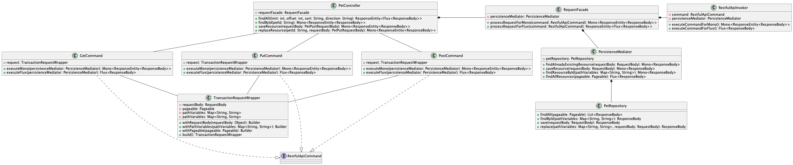
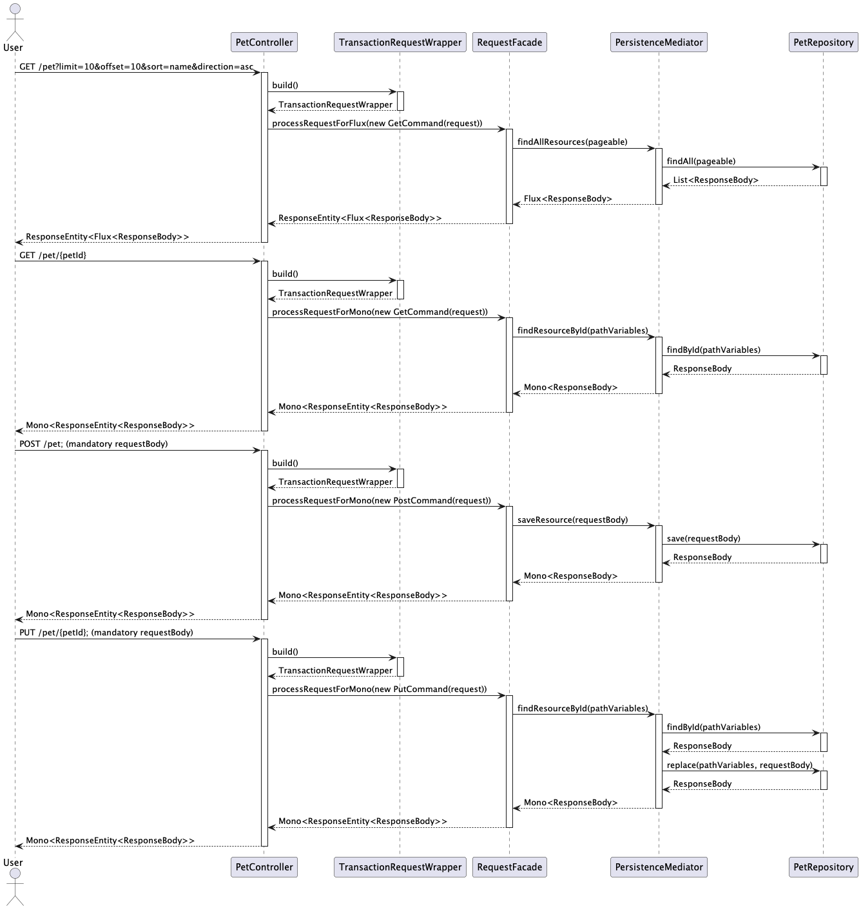
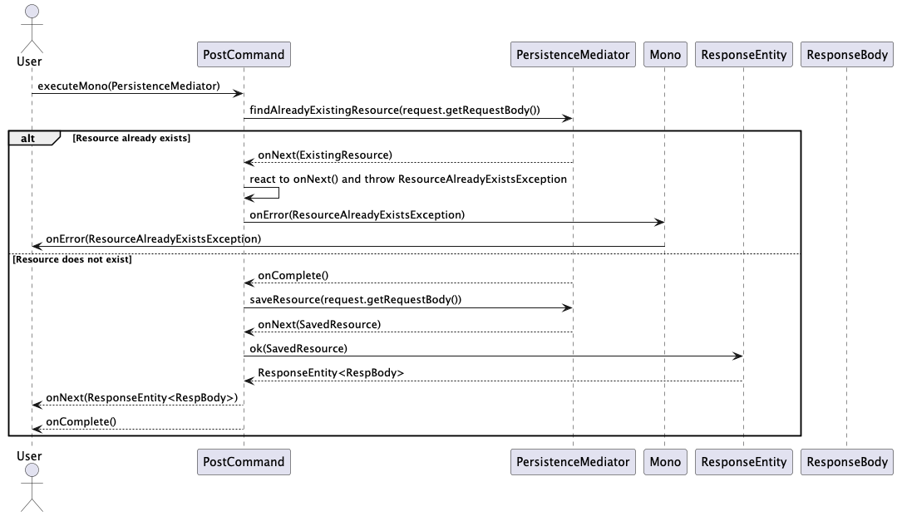
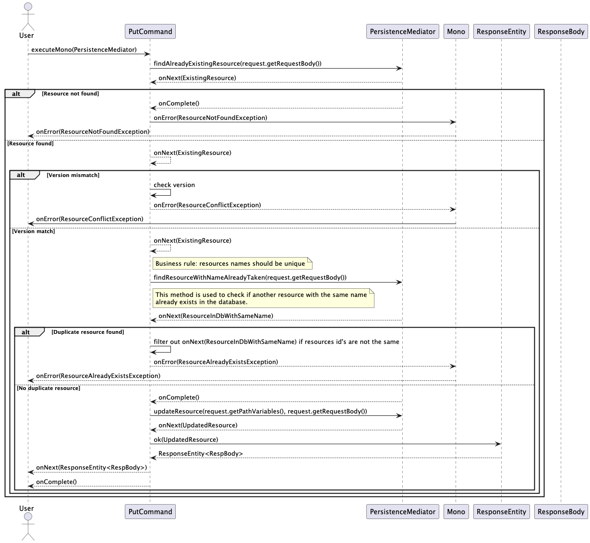

# reactive-petstore-sample
Sample of a pet store web api built with Spring Webflux, it uses design patterns.
It was built only for educational purposes.

## Application explanation






## Usage

```bash
./gradlew bootRun
```

## Contributing
Feel free to create pull requests for this project, the author will review them as soon as possible.

## License
This project is licensed under the Apache 2.0 license - see the [LICENSE](LICENSE) file for details.
```